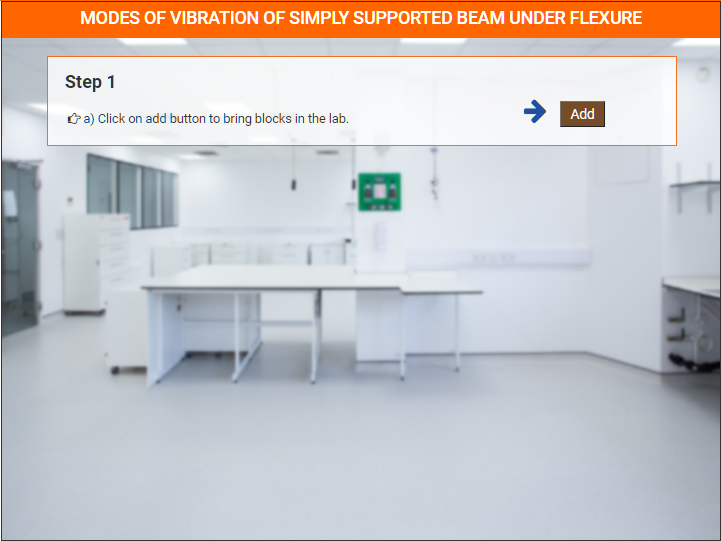
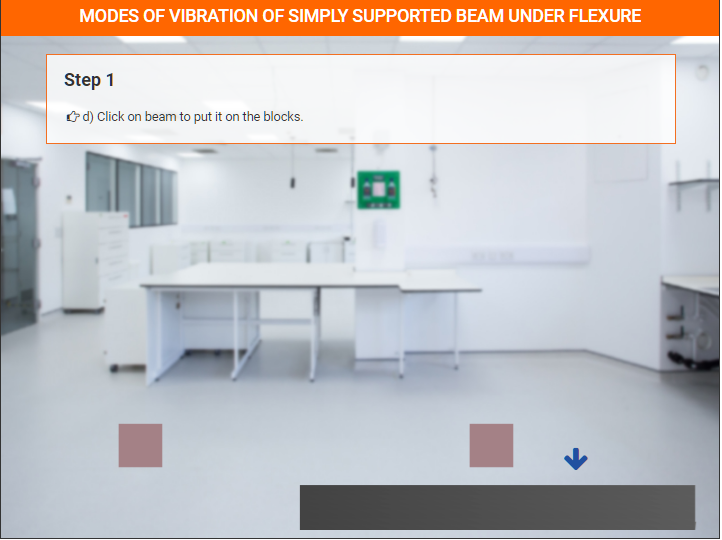
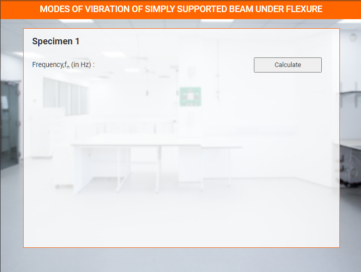

### These steps will be followed for the experiment
**Preparation of specimens:**

1. Click Start Experiment button to start the experiment.

2. Select all the parameters.

3.  Click on Add button to bring pillers in the lab.

4.  Click on add button to bring Beam in the lab.

 
 
5.  Click on Beam to put it on the pillers.

 

6.  Enter details for Specimen 1.

 

7.  Click Calculate button to show frequency graph.

 

8. Repeat the same process for specimen 2 and specimen 3.
   
9. Plot Graph Between Length & Calculated Frequenty.

 

10. Plot Graph Between Elasticity & Calculated Frequenty.

 

11. Plot Graph Between Elasticity & Calculated Frequenty.

 
 
