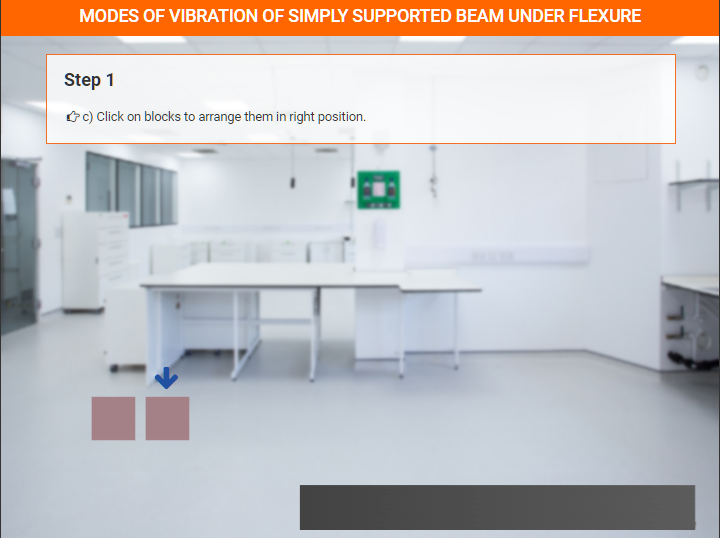

### These steps will be followed for the experiment

<!-- **PRE EXPERIMENT TASK**

1) What is mode of vibration? 
2) What is distributed system? 
3) What is discrete system? 
4) What are the degrees of freedom? 
5) What is the general solution for displacement of beam? 
 -->

**Preparation of specimens:**
1. Click on start experiment button to start the experiment.

Select all the parameters.

Select all the parameters.

Step-1: a) Click on add button to bring blocks in the lab.

Step-1: b) Click on add button to bring beam in the lab.

 

Step-1: c) Click on blocks to arrange them in right position.

 

Step-1: d) Click on beam to put it on the blocks.

Select all the parameters.

 

Select all the parameters.

 

Click on calculate button to calculate Frequency.

Click on calculate button to calculate Frequency.

Select all the parameters.

Select all the parameters.

 

Step-3: a) Click on add button to bring blocks in the lab.

 

Step-3: b) Click on add button to bring beam in the lab.

Step-3: c) Click on blocks to arrange them in right position.

Step-3: d) Click on beam to put it on the blocks.

 

Select all the parameters.

 

Select all the parameters.

Click on calculate button to calculate Frequency.

Click on calculate button to calculate Frequency.

Click on Plot Graph between F and L button to show graph.

Graph

 

Click on Plot Graph between E and F button to show graph.

 

Graph

<!-- **POST EXPERIMENT TASK**

1) Compute the frequency for five different lengths of the beam, keeping
all other parameters constant. Plot a graph between frequency and
length. 
2) Compute the frequency for five different Young’s modulus of the beam,
keeping all other parameters constant. Plot a graph between frequency
and Young’s modulus.   -->
