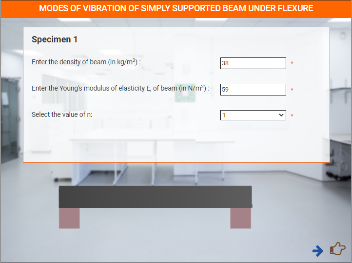

### These steps will be followed for the experiment

**PRE EXPERIMENT TASK**

1) What is mode of vibration? 
2) What is distributed system? 
3) What is discrete system? 
4) What are the degrees of freedom? 
5) What is the general solution for displacement of beam? 

**Preparation of specimens:**

1. Click on Start Experiment button to start the experiment.

2. Select all the parameters.

3. Click on Add button to bring pillers in the lab.

4. Click on add button to bring Beam in the lab.

 

5. Click on Beam to put it on the pillers.

 

6. Enter details for Specimen 1.

 

7. Click Calculate button to show frequency graph.

 

8. Repeat the same process for specimen 2 and specimen 3.
   
9. Plot Graph Between Length & Calculated Frequency.

 

10. Plot graph between Elasticity & Calculated Frequency.

 

11. Plot graph between Elasticity & Calculated Frequency.

 

**POST EXPERIMENT TASK**

1) Compute the frequency for five different lengths of the beam, keeping
all other parameters constant. Plot a graph between frequency and
length. 
2) Compute the frequency for five different Young’s modulus of the beam,
keeping all other parameters constant. Plot a graph between frequency
and Young’s modulus.  
