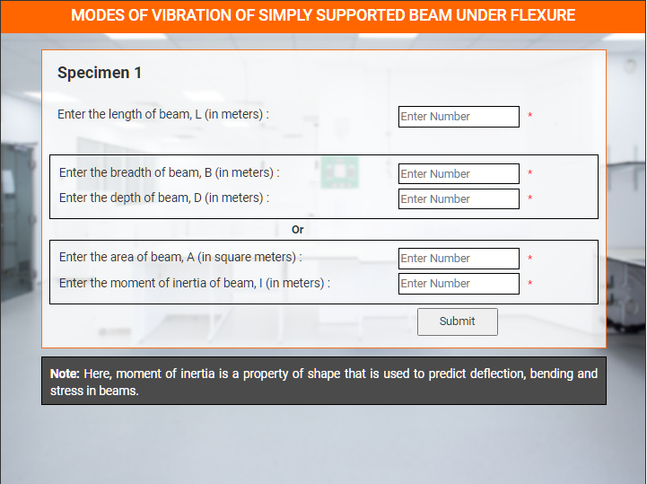
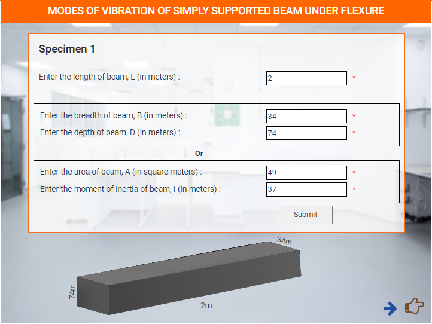

### These steps will be followed for the experiment

<!-- **PRE EXPERIMENT TASK**

1) What is mode of vibration? 
2) What is distributed system? 
3) What is discrete system? 
4) What are the degrees of freedom? 
5) What is the general solution for displacement of beam? 
 -->

**Preparation of specimens:**
1. Click on start experiment button to start the experiment.

stephere

stephere

stephere

 

stephere

 

stephere

 

stephere

stephere

 

stephere

 

stephere

stephere

stephere

stephere

 

stephere

 

stephere

 

stephere

stephere

 

stephere

 

stephere

stephere

stephere

stephere

 

stephere

 

stephere

 

stephere

stephere

 

stephere

 

stephere

 

<!-- **POST EXPERIMENT TASK**

1) Compute the frequency for five different lengths of the beam, keeping
all other parameters constant. Plot a graph between frequency and
length. 
2) Compute the frequency for five different Young’s modulus of the beam,
keeping all other parameters constant. Plot a graph between frequency
and Young’s modulus.   -->
