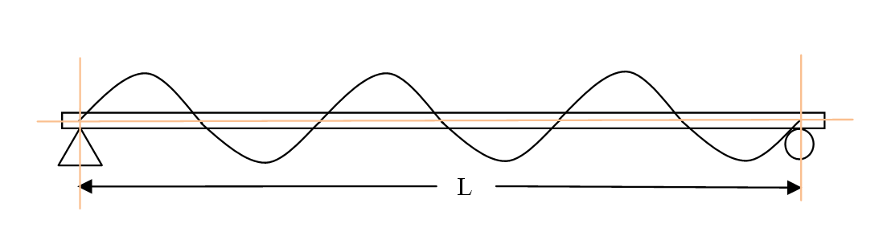

### Theory

This simulation based experiment aims to study the modes of vibration of simply supported beams under flexure. The simply supported beam, a continuous system, is different from a discrete system, where stiffness, mass, and damping are modelled as discrete properties. An alternative method of modelling physical system, which is considered for this beam, is based on the principle of distributed mass and stiffness characteristics. Such a system for which stiffness and mass are considered to be distributed properties (rather than discrete) is referred as a distributed or continuous system.

Unlike a discrete system that possess a finite number of Degree Of Freedom&nbsp;(DOF), the distributed systems, which are considered to be composed of infinite number of infinitesimal mass particles, theoretically possess an infinite number of DOF. However, only the first few modes are significant. It is therefore not necessary to study all of them.

This computational model of Simply Supported Beam is based on distributed system. By using this online simulation, the student/user can easily determine the natural frequencies of beams and simulate the first five mode shapes. In addition, there is an exercise for user: The user can study and plot a graph between natural frequency and length of beams keeping all others factors constant. Similarly, relation between natural frequency and the Young’s Modulus of Elasticity can be studied.

Fig.1 shows the profile of nth modes of vibration of a simply supported beam.

where, <i>L</i> is the length of beam, <i>EI</i> is the flexural rigidity (<i>E</i> = Young's modulus, <i>I</i> = Moment of inertia), <i>A</i> is cross- sectional area, <i>fn</i> is natural frequency and <i>C</i> is constant.

